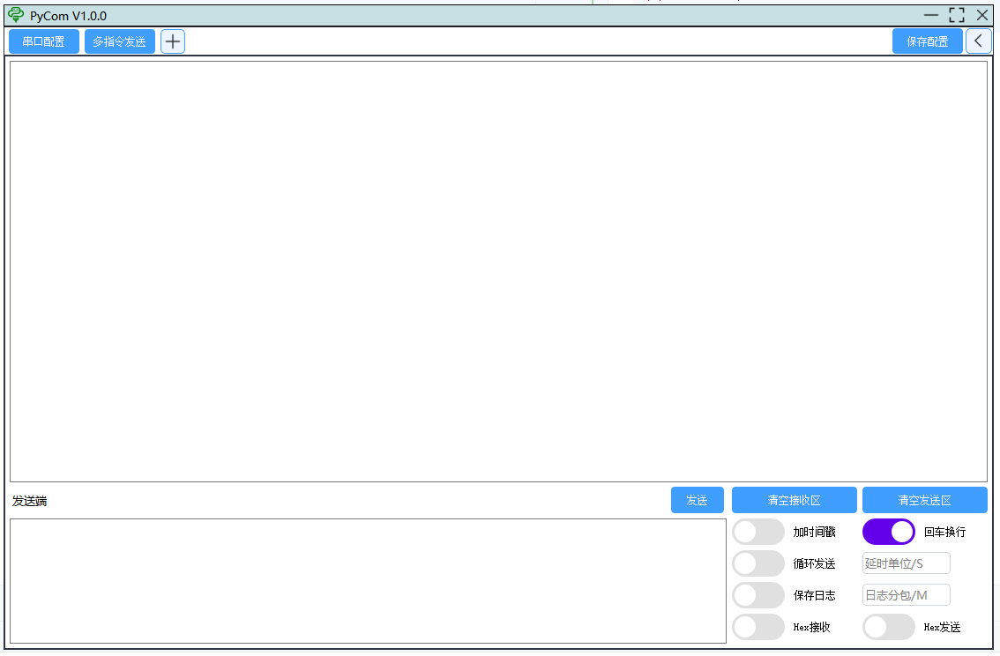
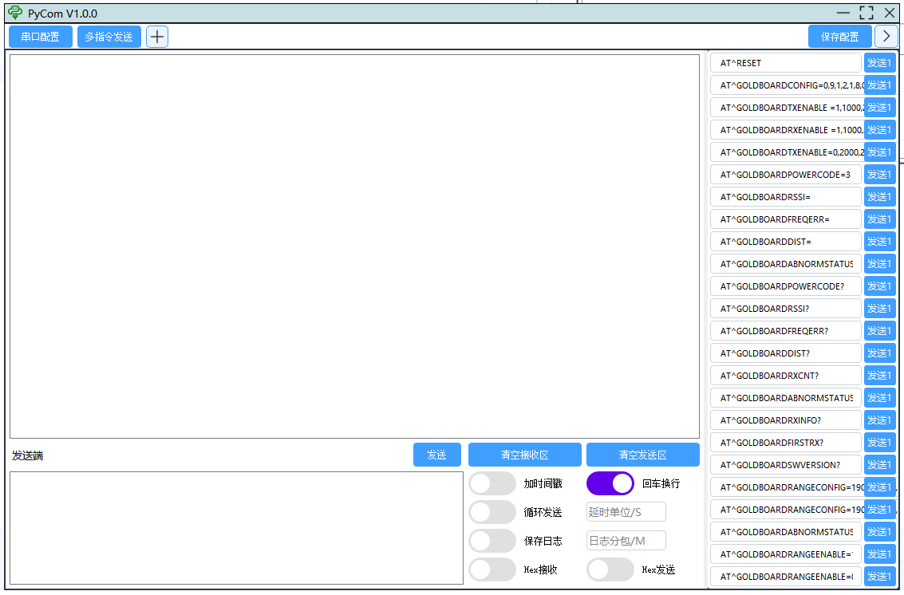
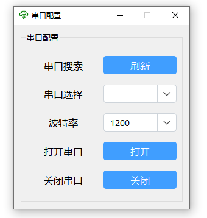
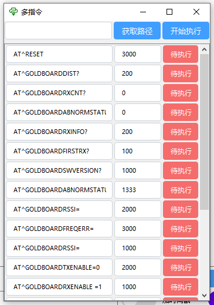
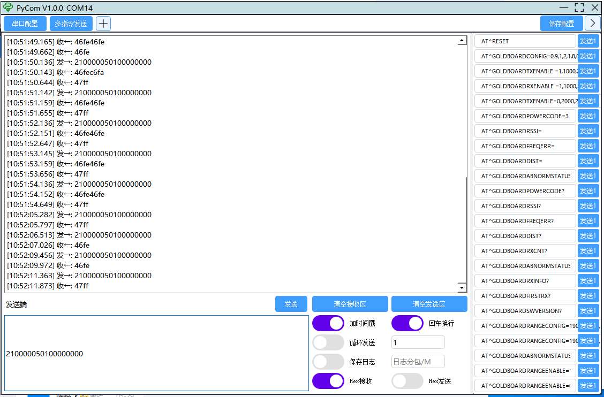

# 🛠️PyCom

##  📝介绍
>业余时间使用pyqt5+pyserial开发的串口工具库，异步串口。UI仿照参考element-plus+一些个人想法制作。

>指令都可通过配置文件配置，侧边栏指令支持自定义的左右拉伸，修改指令后支持保存参数，支持自定义修改配置文件来修改指令。
>
>多指令发送更可以自定义指令顺序以及时间发送，可直接通过csv文件配置，更加的方便。
> 
> 指令发送框支持回车快捷发送，循环发送主要针对指令框的指令进行循环发送

## 📦安装教程
```python
pip freeze > requirements.txt   生成环境依赖文件
pip install -r requirements.txt 安装环境依赖
```

## 🖥️UI简介
### 🏠主页面

### 📚侧边栏

### ⚙️串口设置

### 📜多指令

### 🔧功能使用


## 📂目录简介
### 🧩coustom_ui
>这个目录下都是自定义UI组件 
> 包括了checkbox自定义开关、lineEdit文本输入框、fixedlabel固定样式的文本标签、pushbutton按钮、message_prompt消息弹窗

### 🖼️ui
>这个目录下是主页面、侧边栏、串口设置、多指令

### 🗂️config

>这个目录下是配置文件以及log文件

### 🛠️functions
> 串口的实现、多指令的实现、侧边栏快捷发送、log具体实现、工具类、窗口缩放拉伸等

## 🌟参与贡献
>开发者：清安

>微信：qing_an_an

>公众号：测个der